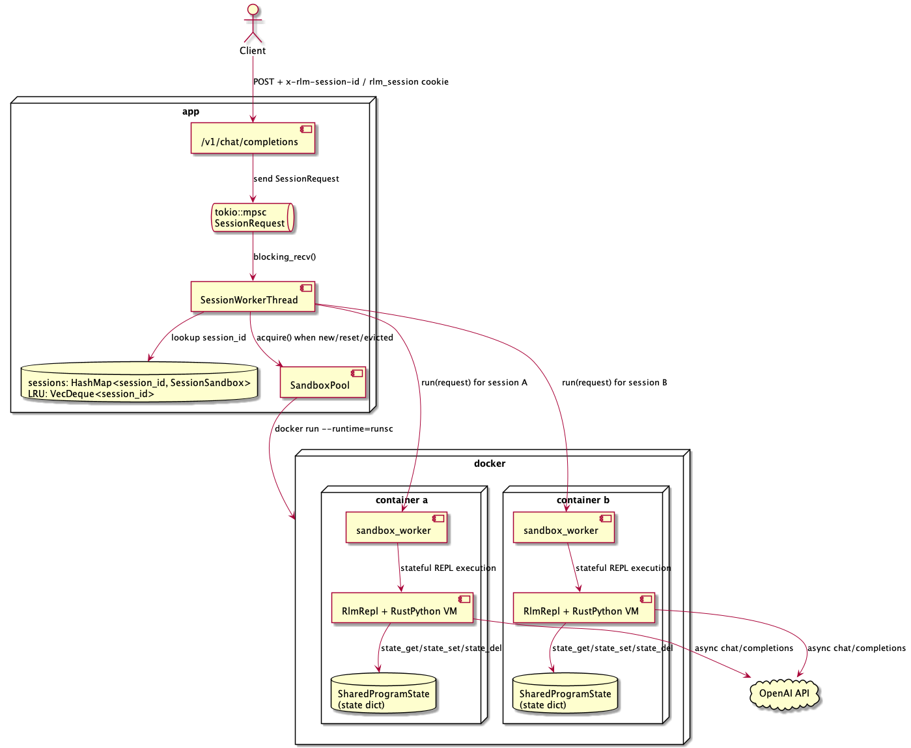
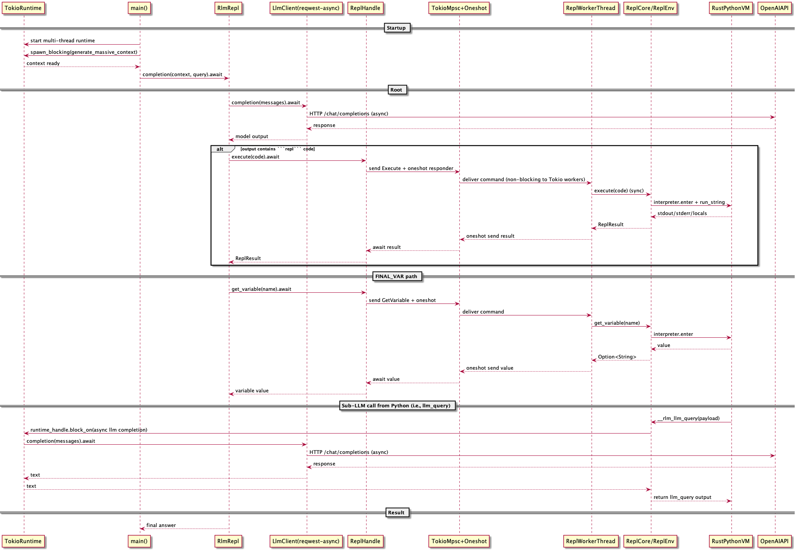
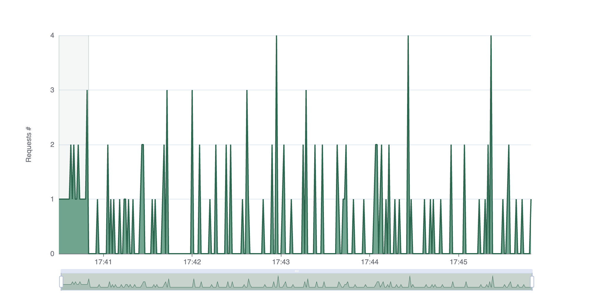

# rlm-rs

RLMs in Rust using RustPython and gVisor


## Development

### System requirements

- [Linux](https://en.wikipedia.org/wiki/Linux) running [x86-64](https://en.wikipedia.org/wiki/X86-64) or [ARM64](https://en.wikipedia.org/wiki/AArch64) architectures. See instructions for running on AWS EC2 below.

### Installation

- [rustup](https://rustup.rs/)
- [prek](https://prek.j178.dev/installation/)

```bash
prek install
```

Linux:

```bash
sudo apt-get update && sudo apt-get install -y runsc
sudo runsc install
sudo systemctl restart docker
```

EC2:

- [aws cli](https://docs.aws.amazon.com/cli/latest/userguide/getting-started-install.html) and [auth setup](https://docs.aws.amazon.com/cli/latest/userguide/cli-chap-authentication.html)

```bash
IAM_USER=<iam-user> make aws-setup                          # optionally specify IAM_USER to create access key, then create key pair
ARCH=arm64 INSTANCE_TYPE=t4g.medium ROOT_GB=50 make create  # optionally specify ARCH, INSTANCE_TYPE, ROOT_GB, then create instance
make conn

# in the instance
make ec2-setup
```

### Setup

Create a `.env` file with the following variables:

```bash
OPENAI_API_KEY=<api-key>
```

### Commands

Run `make help` for the full list of commands.

For both Linux and EC2 instances:

```bash
cargo test
cargo run
make app
make goose HOST=<host>
```

## Roadmap

- [x] port rlm-minimal to Rust and RustPython
- [x] unblock event loop
- [x] add support for depth > 1
- [x] add [shared program state](https://elliecheng.com/blog/2026/01/20/enabling-rlm-with-shared-program-state/)
- [x] add per-session REPL sandboxing with gVisor

## Details

### Sandboxing



Requests within a session remain ordered while different sessions execute concurrently, so one long-running REPL interaction does not create cross-session head-of-line blocking for unrelated traffic. Ingress is bounded and fails fast under saturation instead of queueing indefinitely, and pool ownership is centralized in a single broker to avoid contention around mutable container state.

### Async Runtime



The async runtime separates network-facing work from interpreter execution so that blocking Python operations do not starve request handling or model I/O. REPL commands are dispatched through channels to a dedicated worker thread, which isolates synchronous interpreter calls from the async control plane. A persistent REPL worker is used to preserve interpreter-local state across iterative commands and to avoid per-command thread startup costs.

### Load Testing

The load test runs 20 simulated users for 3 minutes against `/v1/chat/completions`.




## Credit

- [rlm-minimal](https://github.com/alexzhang13/rlm-minimal)
- [rlm blog post](https://alexzhang13.github.io/blog/2025/rlm/)
- [rlm paper](https://arxiv.org/pdf/2512.24601v1)
- [RustPython](https://github.com/RustPython/RustPython)
- [gVisor](https://github.com/google/gvisor)
- [goose](https://github.com/tag1consulting/goose)
