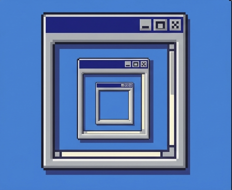

# rlm-rs

RLMs in Rust using RustPython and gVisor



## Development

### System requirements

- [Linux](https://en.wikipedia.org/wiki/Linux) running [x86-64](https://en.wikipedia.org/wiki/X86-64) or [ARM64](https://en.wikipedia.org/wiki/AArch64) architectures. See instructions for running on AWS EC2 below.

### Installation

- [rustup](https://rustup.rs/)
- [prek](https://prek.j178.dev/installation/)

```bash
prek install
```

Linux:

```bash
sudo apt-get update && sudo apt-get install -y runsc
sudo runsc install
sudo systemctl restart docker
```

EC2:

- [aws cli](https://docs.aws.amazon.com/cli/latest/userguide/getting-started-install.html) and [auth setup](https://docs.aws.amazon.com/cli/latest/userguide/cli-chap-authentication.html)

```bash
IAM_USER=<iam-user> SSH_CIDR=<cidr> make setup              # optionally specify IAM_USER to create access key and SSH_CIDR to override detected IP, then create key pair
ARCH=arm64 INSTANCE_TYPE=t4g.medium ROOT_GB=50 make create  # optionally specify ARCH, INSTANCE_TYPE, ROOT_GB, then create instance and connect
make conn

# in the instance
sudo apt-get update
sudo apt-get install -y git docker.io build-essential pkg-config libffi-dev libssl-dev
sudo runsc install
sudo systemctl restart docker
curl --proto '=https' --tlsv1.2 -sSf https://sh.rustup.rs | sh
source $HOME/.cargo/env
cd ~/rlm-rs
```

### Setup

Create a `.env` file with the following variables:

```bash
API_KEY=<api-key>
BASE_URL=<base-url>
```

### Commands

Run `make help` for the full list of commands.

For both Linux and EC2 instances:

```bash
make test
make run
make app
make goose HOST=<host:port>
```

## Roadmap

- [x] port rlm-minimal to Rust and RustPython
- [x] run REPL in gVisor and serve API via axum
- [ ] unblock event loop
- [ ] add support for depth > 1
- [ ] add
      [shared program state](https://elliecheng.com/blog/2026/01/20/enabling-rlm-with-shared-program-state/)
- [ ] replace OpenAI LLM endpoint with Modal
- [ ] add cost tracking

## Credit

- [rlm-minimal](https://github.com/alexzhang13/rlm-minimal)
- [rlm blog post](https://alexzhang13.github.io/blog/2025/rlm/)
- [rlm paper](https://arxiv.org/pdf/2512.24601v1)
- [RustPython](https://github.com/RustPython/RustPython)
- [gVisor](https://github.com/google/gvisor)
- [goose](https://github.com/tag1consulting/goose)
